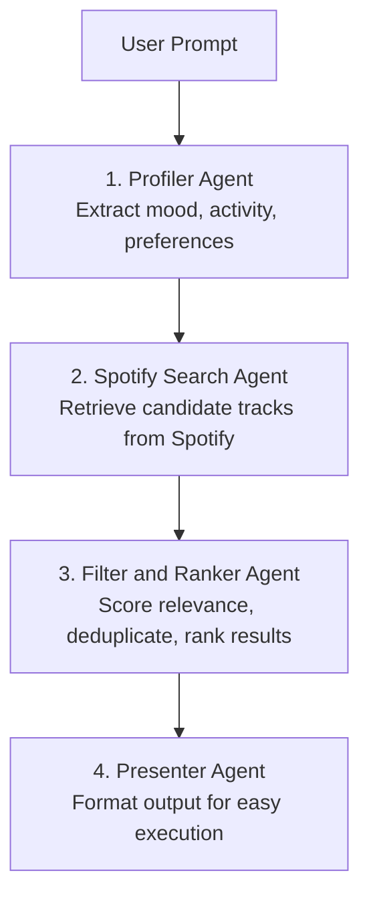

<div align="center">
  
  <h1>SmartDiscover</h1>
  <p><strong>Multi-Agent Music Discovery Assistant for Spotify</strong></p>

  <p>
    
    
    
    
  </p>
</div>

---

> "I need calm and focused music for late-night study sessions."
>
> SmartDiscover transforms natural language prompts into relevant, ranked music recommendations that are ready to become a playlist.

## Why SmartDiscover

SmartDiscover is a 4-agent AI music recommendation system. Instead of relying on literal keyword matching alone, the pipeline splits the process into intent analysis, candidate retrieval, ranking, and result presentation so recommendations feel more natural and contextual.

| Core Value | Impact |
|---|---|
| Multi-agent pipeline | More targeted results than a single-step prompt |
| Spotify integration | Real-time candidate tracks from Spotify's catalog |
| Context-based ranking | Better alignment with user mood and activity |
| Preview-aware retrieval | Better chance to get playable 30s previews |
| Playlist-ready output | Recommendations can be executed immediately |

## 4-Agent Architecture



### 1. Profiler Agent

- Converts natural language input into structured parameters.
- Example parameters: mood, activity, energy level, style preference.

### 2. Spotify Search Agent

- Uses adaptive queries to retrieve candidate tracks.
- Focuses on candidate diversity to avoid repetitive results.

### 3. Filter and Ranker Agent

- Evaluates candidate relevance based on prompt context.
- Produces a prioritized list of the best tracks.

### 4. Presenter Agent

- Delivers final results in a concise, actionable format.
- Ready to continue into playlist creation flow.

---

## Quick Setup

### 1) Create an App in Spotify Developer

1. Open https://developer.spotify.com/dashboard.
2. Create a new application.
3. Add the following Redirect URI:

```text
http://127.0.0.1:8000/auth/callback
```

4. Save your `Client ID` and `Client Secret`.

### 2) Clone the Repository and Install Dependencies

```powershell
git clone https://github.com/wahyu-shiregaru/SmartDiscover.git
cd SmartDiscover

python -m venv .venv
.\.venv\Scripts\Activate.ps1

pip install -r requirements.txt
Copy-Item .env.example .env
```

For macOS/Linux:

```bash
source .venv/bin/activate
cp .env.example .env
```

### 3) Fill the Environment File

```ini
OPENROUTER_API_KEY="your-openrouter-api-key"
OPENROUTER_MODEL="google/gemini-2.5-flash-lite"
OPENROUTER_BASE_URL="https://openrouter.ai/api/v1"
SPOTIFY_CLIENT_ID="your-spotify-client-id"
SPOTIFY_CLIENT_SECRET="your-spotify-client-secret"
SPOTIFY_REDIRECT_URI=""
```

You can switch the LLM model at runtime via `OPENROUTER_MODEL` (for example `openai/gpt-4o-mini`, `anthropic/claude-3.5-sonnet`, or any model available in your OpenRouter account).

For production deployments (for example Vercel), set `SPOTIFY_REDIRECT_URI` explicitly to the exact callback URL registered in Spotify Dashboard, such as:

```text
https://smart-discover.vercel.app/callback
```

Important: Spotify requires an exact match (scheme, domain, and path).

### 4) Run the Application

```powershell
uvicorn app.main:app --reload
```

Open the app at http://127.0.0.1:8000/

## Demo

<div align="center">
  
  <br /><br />
  
</div>

---

## Example User Prompts

- "Late-night coding tracks that keep me focused but not sleepy"
- "A bright and upbeat vibe for an afternoon road trip"
- "Relaxing background music for reading, preferably instrumental"

## Create Spotify Playlists

After generating recommendations, you can save them directly to your Spotify account.

### User Flow

1. **Connect Spotify**: Click the **Connect Spotify** button in the sidebar and sign in to Spotify.
2. **Authorize Access**: Approve playlist permissions when prompted.
3. **Generate Recommendations**: Run your prompt as usual.
4. **Save as Spotify Playlist**: Click **Save as Spotify Playlist** to create a playlist from the selected tracks.

### Required OAuth Scopes

SmartDiscover requests the following Spotify scopes:

- `playlist-modify-public`
- `playlist-modify-private`

### Privacy Behavior

Playlists created by SmartDiscover are **private by default**.
You can change playlist visibility later from your Spotify account.

## Audio Preview Behavior

SmartDiscover includes a mini preview player in each recommendation card.

- If Spotify provides `preview_url`, the card shows an active **Play/Pause** preview control.
- If `preview_url` is missing, SmartDiscover applies a backend fallback by checking Spotify Embed metadata (`__NEXT_DATA__`) to recover `audioPreview.url` when available.
- If no preview is found after fallback, the card still shows a disabled **No Preview** state so users can see that preview is unavailable for that track.

Notes:

- Preview availability is controlled by Spotify catalog metadata and may vary by region/licensing.
- Fallback is best-effort and bounded per request to keep latency stable.

## Fallback Mode

If Spotify credentials are missing or invalid, the application still runs in fallback mode so the interface can be demonstrated.

## Tech Stack

- Backend: FastAPI
- Language: Python
- LLM runtime: OpenRouter
- Music source: Spotify Web API
- Frontend: HTML, CSS, JavaScript

## License

This project is distributed under the MIT License. See LICENSE for details.

## Legal Disclaimer

- This application uses third-party APIs (Spotify and external LLM providers).
- This project is independent and is not affiliated with, endorsed by, or sponsored by Spotify.
- All Spotify trademarks, logos, and brand assets belong to Spotify AB.
- API key usage must comply with each provider's Terms of Service.

---

<div align="center">
  <strong>Maintainer</strong><br />
  wahyu muliadi siregar<br />
  Copyright (c) 2026
</div>
