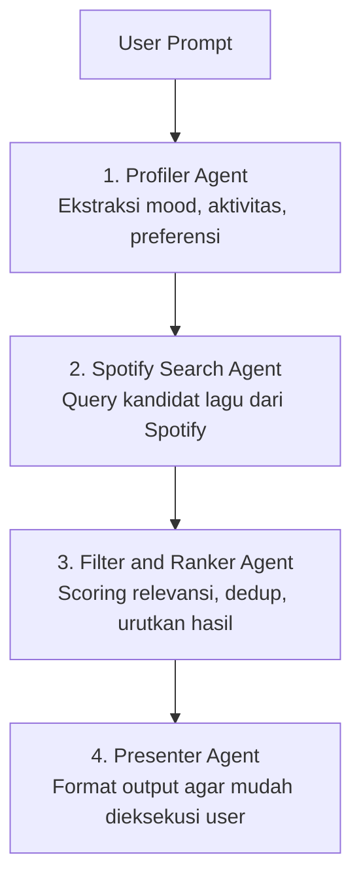

<div align="center">
  
  <h1>SmartDiscover</h1>
  <p><strong>Multi-Agent Music Discovery Assistant for Spotify</strong></p>

  <p>
    
    
    
    
  </p>
</div>

---

> "Aku mau lagu belajar malam yang tenang dan fokus."
>
> SmartDiscover mengubah prompt natural language menjadi rekomendasi lagu yang relevan, terurut, dan siap dijadikan playlist.

## Kenapa SmartDiscover

SmartDiscover adalah sistem rekomendasi musik berbasis 4 agent AI. Alih-alih hanya melakukan pencarian literal, pipeline ini memecah tugas menjadi analisis intent, pencarian kandidat, ranking, dan presentasi hasil agar rekomendasi terasa lebih natural.

| Nilai Utama | Dampak |
|---|---|
| Multi-agent pipeline | Hasil lebih terarah dibanding single-step prompt |
| Integrasi Spotify | Kandidat lagu real-time dari katalog Spotify |
| Ranking berbasis konteks | Output lebih sesuai mood dan aktivitas user |
| Siap dihubungkan ke playlist | Rekomendasi bisa langsung dieksekusi |

## Arsitektur 4 Agent



### 1. Profiler Agent

- Mengubah input natural language menjadi parameter terstruktur.
- Contoh parameter: mood, aktivitas, energi, preferensi style.

### 2. Spotify Search Agent

- Menggunakan query adaptif untuk mengambil kandidat lagu.
- Fokus pada keberagaman kandidat agar hasil tidak repetitif.

### 3. Filter and Ranker Agent

- Menilai relevansi kandidat berdasarkan konteks prompt.
- Menyusun daftar prioritas lagu terbaik.

### 4. Presenter Agent

- Menyajikan hasil akhir dalam format yang ringkas dan actionable.
- Siap dilanjutkan ke flow pembuatan playlist.

---

## Setup Cepat

### 1) Buat App di Spotify Developer

1. Buka https://developer.spotify.com/dashboard.
2. Buat aplikasi baru.
3. Tambahkan Redirect URI berikut:

```text
http://127.0.0.1:8000/auth/callback
```

4. Simpan `Client ID` dan `Client Secret`.

### 2) Clone dan Install Dependency

```powershell
git clone https://github.com/wahyu-shiregaru/SmartDiscover.git
cd SmartDiscover

python -m venv .venv
.\.venv\Scripts\Activate.ps1

pip install -r requirements.txt
Copy-Item .env.example .env
```

Untuk macOS/Linux:

```bash
source .venv/bin/activate
cp .env.example .env
```

### 3) Isi File Environment

```ini
OPENROUTER_API_KEY="sk-or-v1-apikey-kamu..."
SPOTIFY_CLIENT_ID="d8be....dari-dashboard-kamu"
SPOTIFY_CLIENT_SECRET="a449....client-secret-kamu"
```

### 4) Jalankan Aplikasi

```powershell
uvicorn app.main:app --reload
```

Buka aplikasi di http://127.0.0.1:8000/

---

## Contoh Prompt User

- "Lagu coding malam yang fokus tapi tidak bikin ngantuk"
- "Vibe roadtrip sore yang cerah dan upbeat"
- "Musik santai buat baca buku, instrumental lebih bagus"

## Fallback Mode

Jika kredensial Spotify belum valid atau belum diisi, aplikasi tetap berjalan dalam mode fallback agar antarmuka tetap bisa didemokan.

## Tech Stack

- Backend: FastAPI
- Language: Python
- LLM runtime: OpenRouter
- Music source: Spotify Web API
- Frontend: HTML, CSS, JavaScript

## Lisensi

Project ini menggunakan MIT License. Lihat file LICENSE.

## Legal Disclaimer

- Aplikasi ini menggunakan API pihak ketiga (Spotify dan provider LLM eksternal).
- Proyek ini independen dan tidak berafiliasi, disponsori, atau didukung resmi oleh Spotify.
- Seluruh merek dagang, logo, dan aset Spotify adalah milik Spotify AB.
- Penggunaan API key wajib mengikuti Terms of Service masing-masing penyedia.

---

<div align="center">
  <strong>Maintainer</strong><br />
  wahyu muliadi siregar<br />
  Copyright (c) 2026
</div>
