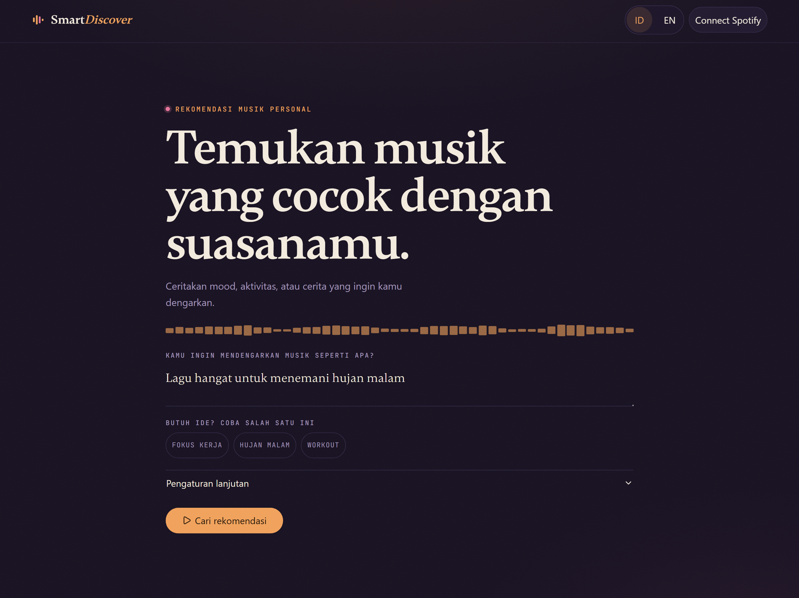
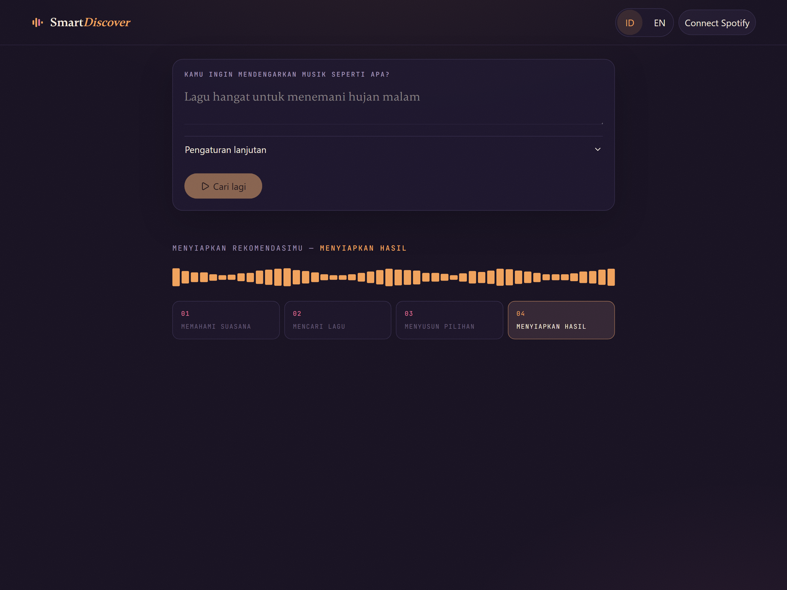
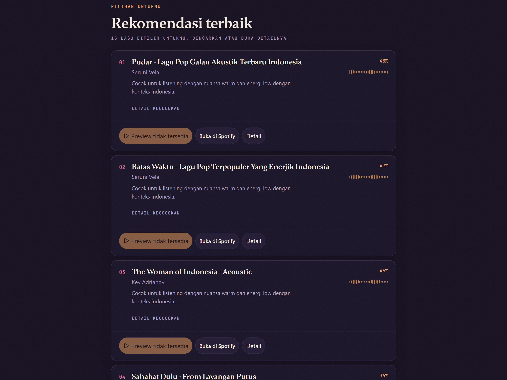
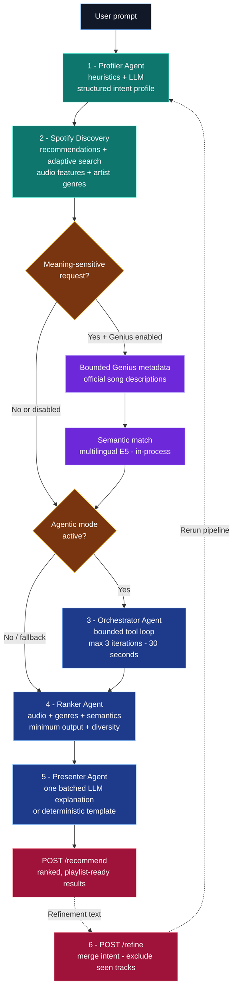

<div align="center">
  
  <h1>SmartDiscover</h1>
  <p><strong>Multi-Agent Music Discovery Assistant for Spotify</strong></p>

  <p>
    
    
    
    
    
  </p>

  <p>
    <a href="https://smart-discover.vercel.app/"></a>
    <a href="https://smart-discover.vercel.app/health"></a>
    <a href="LICENSE"></a>
  </p>

  <p>
    <a href="#screenshots">Screenshots</a> &middot;
    <a href="#why-smartdiscover">Why SmartDiscover</a> &middot;
    <a href="#agentic-architecture">Architecture</a> &middot;
    <a href="#quick-setup">Setup</a> &middot;
    <a href="#deploy-on-vercel">Deploy</a> &middot;
    <a href="#api-endpoints">API</a> &middot;
    <a href="#tests-and-eval-harness">Tests</a>
  </p>
</div>

---

> "Ceritakan suasana hatimu — kami carikan musiknya."
>
> SmartDiscover transforms natural language prompts — in Indonesian or English — into relevant, ranked music recommendations that are ready to be previewed, refined, and saved as a Spotify playlist. A multi-agent pipeline splits the work into intent analysis, candidate retrieval, semantic matching, ranking, and presentation so the results feel natural and contextual, not like keyword search.

## Screenshots

<div align="center">
  
  <br /><br />
  
  <br /><br />
  
</div>

## Why SmartDiscover

SmartDiscover is a multi-agent music discovery pipeline with optional agentic orchestration using LLM tool-calling. Instead of relying on literal keyword matching alone, the pipeline splits the process into intent analysis, candidate retrieval, ranking, and result presentation so recommendations feel more natural and contextual.

| Layer | What it contributes | Built-in guardrail |
|---|---|---|
| Intent | Extracts mood, activity, genre, locale, audio targets, and lyric intent | Heuristics preserve high-confidence signals when the LLM misses them |
| Discovery | Retrieves and enriches Spotify candidates in parallel | Adaptive search fills catalog shortfalls |
| Semantics | E5 compares meaning-sensitive intent with bounded Genius descriptions | No full-lyrics claim and no extra OpenRouter tokens |
| Orchestration | Optionally calls tools to improve the candidate pool | Three-iteration and 30-second hard limits |
| Ranking | Combines audio features, genres, semantic signals, and diversity | Deterministic fallback and minimum-output guard |
| Delivery | Explains results, previews tracks, and creates private playlists | OAuth token remains in a signed HttpOnly cookie |

### Frontend

The React frontend (`frontend/`) is designed as a late-night listening console:

- **Bilingual** — Indonesian and English interfaces, switched from the header.
- **Describe, don't search** — a lyric-sheet composer for your mood; quick prompts for instant ideas.
- **Signal line** — the hero waveform becomes the live pipeline progress while searching, and every track row carries a mini waveform drawn from that track's real audio features (energy, valence, tempo). It animates as an equalizer while a preview plays.
- **Tracklist results** — ranked rows with match score, 30-second previews, per-track reasoning, and a matrix line summarizing the detected intent (mood, activity, count, confidence).
- **Refine and export** — follow-up refinements ("lebih ceria, lebih lambat...") re-run the pipeline excluding seen tracks, and one click saves the result as a private Spotify playlist.
- **Accessibility** — keyboard-visible focus, reduced-motion support, 44px touch targets, and proper ARIA roles throughout.

## Agentic Architecture


```mermaid
flowchart TD
  U["User prompt"] --> P["1 - Profiler Agent<br/>heuristics + LLM<br/>structured intent profile"]
  P --> S["2 - Spotify Discovery<br/>recommendations + adaptive search<br/>audio features + artist genres"]
  S --> Q{"Meaning-sensitive<br/>request?"}

  Q -- "Yes + Genius enabled" --> G["Bounded Genius metadata<br/>official song descriptions"]
  G --> E5["Semantic match<br/>multilingual E5 - in-process"]
  Q -- "No or disabled" --> M{"Agentic mode<br/>active?"}
  E5 --> M

  M -- "Yes" --> O["3 - Orchestrator Agent<br/>bounded tool loop<br/>max 3 iterations - 30 seconds"]
  M -- "No / fallback" --> R["4 - Ranker Agent<br/>audio + genres + semantics<br/>minimum output + diversity"]
  O --> R
  R --> V["5 - Presenter Agent<br/>one batched LLM explanation<br/>or deterministic template"]
  V --> OUT["POST /recommend<br/>ranked, playlist-ready results"]
  OUT -. "Refinement text" .-> REF["6 - POST /refine<br/>merge intent - exclude seen tracks"]
  REF -. "Rerun pipeline" .-> P

  classDef entry fill:#111827,stroke:#60A5FA,color:#FFFFFF;
  classDef discovery fill:#0F766E,stroke:#5EEAD4,color:#FFFFFF;
  classDef semantic fill:#6D28D9,stroke:#C4B5FD,color:#FFFFFF;
  classDef decision fill:#78350F,stroke:#FBBF24,color:#FFFFFF;
  classDef agent fill:#1E3A8A,stroke:#93C5FD,color:#FFFFFF;
  classDef endpoint fill:#9F1239,stroke:#FDA4AF,color:#FFFFFF;

  class U entry;
  class P,S discovery;
  class G,E5 semantic;
  class Q,M decision;
  class O,R,V agent;
  class OUT,REF endpoint;
```

### 1. Profiler Agent

- Hybrid: heuristic detector runs first (high precision for Indonesian genres), LLM extracts richer signals.
- Outputs `IntentProfile`: mood, activity, genre, energy, language, locale, strict_locale, **confidence**, **target_audio** (numeric audio targets), **seed_genres** (Spotify-canonical), decade.
- LLM call uses `response_format=json_object` + 4 few-shot examples; low-confidence results trigger one retry.
- Heuristic genre & locale findings are merged with LLM output (heuristic acts as floor; LLM cannot drop them).

### 2. Spotify Discovery Agent

- Tries `GET /v1/recommendations` first when `seed_genres` resolve against `available-genre-seeds`.
- Supplements with playlist + adaptive search when shortfall.
- Enriches every candidate with `GET /v1/audio-features` (tempo, energy, valence, danceability, acousticness, instrumentalness, loudness) and `GET /v1/artists` (artist genres) — all batched and parallel.
- Dynamic `market` derived from intent locale.

### Lyric-Metadata Semantic Layer

- Enabled only when `GENIUS_LYRICS_ENABLED=true` and `GENIUS_ACCESS_TOKEN` is configured.
- Enriches a bounded set of top candidates with Genius song-description metadata; the official API does not provide full lyric text.
- For meaning-sensitive prompts, `intfloat/multilingual-e5-small` compares the preserved lyrical intent against available descriptions and produces request-local relative scores for the ranker.
- E5 runs in-process and does not spend OpenRouter tokens for semantic scoring. It loads at application startup and may download about 471 MB of model weights on the first startup.
- Title-only metadata receives no inferred themes, sentiment, or semantic score. SmartDiscover therefore does not claim to understand the complete meaning of a song.

| SmartDiscover can | SmartDiscover does not claim |
|---|---|
| Compare a user's lyrical intent with available official description metadata | Read, store, or understand the complete lyrics |
| Pass a request-local semantic score to the ranker | Treat a title-only match as evidence of theme or sentiment |

### 3. Orchestrator Agent (opt-in / runtime selectable)

- Activated when `AGENT_LOOP_ENABLED=true` or when a request sends `agentic_mode="agentic"`.
- Tool-use loop via OpenRouter function calling: `request_more_candidates`, `filter_by_audio`, `request_audio_features`, `request_lyric_signals`, `finalize`.
- Hard limits: 3 iterations, 30s wall, bounded candidate pool, validated tool inputs, automatic fallback on failure.
- Every response includes `quality_notes.agentic` with requested/effective mode, status, iteration count, tool path, trace summaries, finalized flag, and fallback reason.

### 4. Ranker Agent

- Sends LLM **rich context**: audio features + artist genres per candidate (no longer guesses from track name).
- **Min-output guard**: if LLM ranks fewer than `top_k`, fills from heuristic-scored remainder.
- **Artist diversity**: max 2 tracks per artist when alternatives exist.
- Heuristic fallback uses Euclidean distance between candidate audio features and `profile.target_audio`.

### 5. Presenter Agent

- Generates a unique `why` sentence per track in **one** batched LLM call when the ranker did not supply reasons.
- Language-aware (id / en).
- Falls back to deterministic template when LLM is disabled.

### 6. `/refine` (multi-turn)

- Stateless: client posts `{previous_profile, previous_track_ids, refinement_text, agentic_mode?}`.
- Pipeline merges previous intent + refinement, re-runs Spotify discovery + ranker, and always excludes already-seen track ids.

---

## Quick Setup

### 1) Create an App in Spotify Developer

1. Open https://developer.spotify.com/dashboard.
2. Create a new application.
3. Add the following Redirect URI:

```text
http://127.0.0.1:8000/auth/callback
```

4. Save your `Client ID` and `Client Secret`.

### 2) Clone the Repository and Install Dependencies

```powershell
git clone https://github.com/Wahyu-Siregar/SmartDiscover.git
cd SmartDiscover

python -m venv .venv
.\.venv\Scripts\Activate.ps1

pip install -r requirements.txt
Copy-Item .env.example .env
```

For macOS/Linux:

```bash
source .venv/bin/activate
cp .env.example .env
```

### 3) Fill the Environment File

```ini
OPENROUTER_API_KEY="your-openrouter-api-key"
OPENROUTER_MODEL="google/gemini-2.5-flash-lite"
OPENROUTER_BASE_URL="https://openrouter.ai/api/v1"
SPOTIFY_CLIENT_ID="your-spotify-client-id"
SPOTIFY_CLIENT_SECRET="your-spotify-client-secret"
SPOTIFY_REDIRECT_URI=""
SPOTIFY_DEFAULT_MARKET="ID"

# Required in production. Long random string (>=32 chars).
SESSION_SECRET=""

# Rate limit (slowapi syntax).
RATE_LIMIT_RECOMMEND="10/minute"

# Public base URL of this app (used for OpenRouter HTTP-Referer).
APP_PUBLIC_URL="http://localhost:8000"
# Set to true behind HTTPS in production.
COOKIE_SECURE="false"
```

You can switch the LLM model at runtime via `OPENROUTER_MODEL` (for example `openai/gpt-4o-mini`, `anthropic/claude-3.5-sonnet`, or any model available in your OpenRouter account).

For production deployments (for example Vercel), set `SPOTIFY_REDIRECT_URI` explicitly to the exact callback URL registered in Spotify Dashboard, such as:

```text
https://smart-discover.vercel.app/callback
```

Important: Spotify requires an exact match (scheme, domain, and path).

### Environment variables reference

| Variable | Required | Default | Purpose |
|---|---|---|---|
| `OPENROUTER_API_KEY` | yes (LLM mode) | - | OpenRouter API key. If empty, app runs in heuristic-only fallback. |
| `OPENROUTER_MODEL` | no | `google/gemini-2.5-flash-lite` | LLM model id. |
| `OPENROUTER_BASE_URL` | no | `https://openrouter.ai/api/v1` | OpenRouter base URL. |
| `SPOTIFY_CLIENT_ID` / `SPOTIFY_CLIENT_SECRET` | yes (real catalog) | - | Spotify Web API credentials. If empty, app uses mock candidates. |
| `SPOTIFY_REDIRECT_URI` | prod | derived | Exact callback URL registered in Spotify Dashboard. |
| `SPOTIFY_DEFAULT_MARKET` | no | `ID` | Spotify market code fallback. Auto-derived from intent locale when possible. |
| `TOP_K_DEFAULT` | no | `15` | Default recommendation count when `target_count` is omitted. |
| `SESSION_SECRET` | **prod** | dev placeholder | Signs the HttpOnly OAuth session cookie. Use a long random string in production. |
| `RATE_LIMIT_RECOMMEND` | no | `10/minute` | slowapi limit on `/recommend`. |
| `APP_PUBLIC_URL` | no | `http://localhost:8000` | Public base URL; used as `HTTP-Referer` for OpenRouter. |
| `COOKIE_SECURE` | prod | `false` | Set `true` when serving behind HTTPS. |
| `AGENT_LOOP_ENABLED` | no | `false` | Enable orchestrator tool-use loop by default. Individual requests can still force it with `agentic_mode="agentic"` when the LLM is enabled. |
| `AGENT_LOOP_MAX_ITERATIONS` | no | `3` | Hard limit for orchestrator iterations. |
| `AGENT_LOOP_TIMEOUT_S` | no | `30.0` | Wall-clock budget for the orchestrator. |
| `AUDIO_FEATURE_CACHE_TTL_S` | no | `86400` | In-memory TTL for Spotify audio-feature responses. |
| `GENIUS_ACCESS_TOKEN` | no | - | Genius API bearer token for optional lyric-signal enrichment. |
| `GENIUS_LYRICS_ENABLED` | no | `false` | Enables bounded Genius lookup for top candidates only. |
| `GENIUS_LYRICS_TOP_N` | no | `10` | Maximum candidates enriched per request to avoid token/API explosion. |
| `GENIUS_LYRICS_CACHE_TTL_S` | no | `86400` | TTL for cached Genius lyric signals. |
| `EVAL_PASS_THRESHOLD` | no | `0.7` | Pass threshold used by `evals/run_eval.py` exit code. |

Note: the official Genius API does not return full lyric text. SmartDiscover derives bounded semantic signals only from Genius description metadata; title-only matches receive no inferred themes or sentiment. The system does not claim to know full lyric meaning. Full lyric-text retrieval should use a licensed lyrics provider before storing or displaying lyrics.

SmartDiscover has no database-backed prompt history or analytics persistence. Runtime profile, search, and API caches are in-memory and expire automatically.

No Spotify account data is stored by SmartDiscover. The Spotify access token lives only in an HttpOnly, signed session cookie scoped to your browser and never reaches `localStorage`.

### 4) Run the Application

For local development, run the FastAPI API and React/Vite frontend in separate terminals:

```powershell
# terminal 1
.\.venv\Scripts\python.exe -m uvicorn app.main:app --reload --port 8000

# terminal 2
Set-Location frontend
npm install
npm run dev
```

Vite proxies API and OAuth requests to FastAPI. Spotify OAuth remains handled by FastAPI with browser cookies, so the frontend does not need a token environment variable.

For production-like local serving, build the frontend and let FastAPI serve it:

```powershell
Set-Location frontend
npm ci
npm run build
Set-Location ..
.\.venv\Scripts\python.exe -m uvicorn app.main:app --port 8000
```

The integrated server is available at http://127.0.0.1:8000/.

If you only need the backend while developing an API route:

```powershell
uvicorn app.main:app --reload
```

Open the app at http://127.0.0.1:8000/

### Deploy on Vercel

The current production deployment is [smart-discover.vercel.app](https://smart-discover.vercel.app/). Vercel detects the repository as a FastAPI project.

`sentence-transformers` and PyTorch exceed Vercel's standard Python Function bundle limit, so enable Large Functions in the Vercel project for both Production and Preview:

```ini
VERCEL_SUPPORT_LARGE_FUNCTIONS="1"
APP_PUBLIC_URL="https://smart-discover.vercel.app"
SPOTIFY_REDIRECT_URI="https://smart-discover.vercel.app/callback"
COOKIE_SECURE="true"
```

Add the remaining variables from `.env.example`, redeploy, then verify:

```text
https://smart-discover.vercel.app/health
```

The first cold start can be slower while E5 is downloaded and loaded. A successful deployment should return `{"status":"ok","service":"smartdiscover-api"}` from `/health`.

### Agentic demo mode

Use the **Agent Mode** selector in the form:

- `Auto`: follows `AGENT_LOOP_ENABLED`.
- `Agentic`: forces the orchestrator loop when `OPENROUTER_API_KEY` is configured.
- `Linear`: bypasses the orchestrator for a deterministic pipeline baseline.

The **Behind the scenes** panel shows the effective mode, loop status, tool path, trace summaries, and fallback reason.

## Example User Prompts

- "Late-night coding tracks that keep me focused but not sleepy"
- "A bright and upbeat vibe for an afternoon road trip"
- "Relaxing background music for reading, preferably instrumental"
- "Musik fokus untuk bekerja tanpa distraksi"
- "Lagu hangat untuk menemani hujan malam"

## Create Spotify Playlists

After generating recommendations, you can save them directly to your Spotify account.

### User Flow

1. **Connect Spotify**: Click the **Connect Spotify** button in the top ribbon and sign in to Spotify.
2. **Authorize Access**: Approve playlist permissions when prompted.
3. **Generate Recommendations**: Run your prompt as usual.
4. **Save as Spotify Playlist**: Click **Save as Spotify Playlist** to create a playlist from the selected tracks.

### Required OAuth Scopes

SmartDiscover requests the following Spotify scopes:

- `playlist-modify-public`
- `playlist-modify-private`

### Privacy Behavior

Playlists created by SmartDiscover are **private by default**.
You can change playlist visibility later from your Spotify account.

## Audio Preview Behavior

SmartDiscover includes a mini preview player in each recommendation row.

- If Spotify provides `preview_url`, the row shows an active **Play/Pause** preview control and the mini waveform animates as an equalizer while it plays.
- If `preview_url` is missing, SmartDiscover applies a backend fallback by checking Spotify Embed metadata (`__NEXT_DATA__`) to recover `audioPreview.url` when available.
- If no preview is found after fallback, the row still shows a disabled **No Preview** state so users can see that preview is unavailable for that track.

Notes:

- Preview availability is controlled by Spotify catalog metadata and may vary by region/licensing.
- Fallback is best-effort and bounded per request to keep latency stable.

## Fallback Mode

If Spotify credentials are missing, the application uses deterministic mock candidates so the interface and pipeline can still be demonstrated. Invalid credentials are reported as Spotify errors rather than silently replaced with mock data.

## API Endpoints

| Method | Path | Description |
|---|---|---|
| `GET`  | `/health` | Liveness check. |
| `GET`  | `/spotify/health` | Spotify reachability. |
| `GET`  | `/llm/health` | OpenRouter reachability. |
| `POST` | `/recommend` | Run the full pipeline. Body: `{text, target_count?, agentic_mode?}` where `agentic_mode` is `auto`, `agentic`, or `linear`. |
| `POST` | `/refine` | Multi-turn refine. Body: `{previous_profile, previous_track_ids, refinement_text, target_count?, agentic_mode?}`. |
| `GET`  | `/auth/login` → `/auth/callback` | Spotify OAuth (HttpOnly cookie session, CSRF-protected). |
| `GET`  | `/auth/status` | Returns `{connected, expires_at}`. |
| `POST` | `/auth/logout` | Clears the session cookie. |
| `POST` | `/create-playlist` | Creates a private Spotify playlist from the current selection (requires session cookie). |

## Tests and Eval Harness

Run the frontend unit tests:

```powershell
Set-Location frontend
npm test
```

Run the backend unit tests:

```powershell
python -m pytest -q
```

Run the offline regression gate for intent profiling and lyric-intent extraction:

```powershell
.\.venv\Scripts\Activate.ps1
python -m evals.run_eval
```

Outputs aggregate intent metrics plus `meaning_required_match`, `lyrical_intent_recall`, and `semantic_overall`, then saves a per-prompt JSON to `evals/results/`. Exits `0` only when both `overall` and `semantic_overall` meet `EVAL_PASS_THRESHOLD`. Edit `evals/golden_prompts.json` to update the gold set.

## Tech Stack

- Backend: FastAPI
- Language: Python
- LLM runtime: OpenRouter
- Music source: Spotify Web API
- Optional lyric metadata: Genius API
- Embeddings: Sentence Transformers + multilingual E5
- Frontend: React 19, TypeScript, Vite, Tailwind CSS v4, Motion, Radix UI
- Fonts: Gambetta, General Sans (Fontshare), JetBrains Mono
- Deployment: Vercel Large Functions

## License

This project is distributed under the MIT License. See LICENSE for details.

## Legal Disclaimer

- This application uses third-party APIs (Spotify and external LLM providers).
- This project is independent and is not affiliated with, endorsed by, or sponsored by Spotify.
- All Spotify trademarks, logos, and brand assets belong to Spotify AB.
- API key usage must comply with each provider's Terms of Service.

---

<div align="center">
  <strong>Maintainer</strong><br />
  wahyu muliadi siregar<br />
  Copyright (c) 2026
</div>
